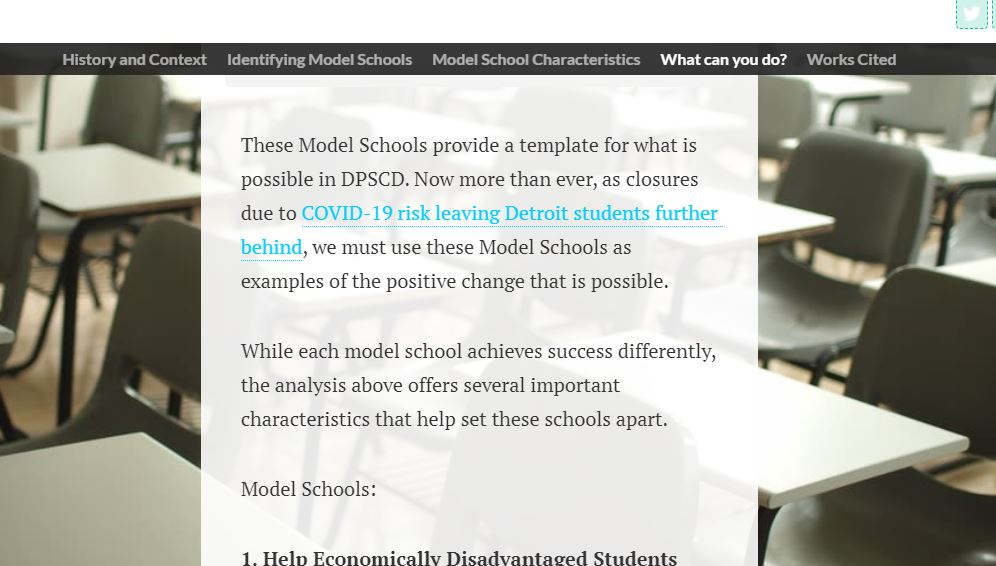

[Return to home](https://danieldistler-1.github.io/Distler-portfolio/)

[Link to Part I](/final_project_DanielDistler.md)

[Link to Part II](/FinalprojectII.md)

# Final Project Part III 

## Refining My Audience

To create the final version of my project, I knew I first I had to ensure that I had a clearly defined audience. In part II, I had a decent sense of my audience but for part III I wanted to narrow this focus. My audience for this project now became:

**1. DPSCD Educators** 

While my project was initially geared towards all educators, I realized my narrative should really be specifically tailored to interest DPSCD educators. Education professionals within DPSCD are the primary participants in the district. As a result, they have the greatest stake in school performance and should ideally be interested in the project. Furthermore, I geared my project at typically jaded teachers in the district. Meaning teachers, who are typically feeling down about the difficulty of their work. This is because, in my time teaching 6th grade in DPSCD, I often felt bogged down by the weight and difficulty of simply teaching everyday. In these moments, it was easy to lose sight of bigger picture goals that are best assessed at the district level. I am aiming my project at DSPCD teachers, who are intimately familiar with DPSCD, to help give a sense of the bigger picture of the district’s progress. In particular, I hope to gain insights about model schools within the district that can help these teachers and educators improve outcomes in their own classrooms. 

**2. Parents and Community Members in Southeast Michigan**

In the first part of my project, I aimed the project more generically at community members in Southeast Michigan. For this final part, I decided to narrow my focus to engage with parents of DPSCD students more directly. This is primarily because as I built out the resources included in the call to action, while originally aimed at teachers, I realized this could be useful for parents more directly than other community members. These resources could help further engage, parents with their child’s education and make them aware of Detroit’s and DPSCD’s revitalization efforts. 

## Implementing Past Feedback:
Finally, to create my final product, I focused on implementing the changes I had identified from Part II after receiving feedback. These were:

**1. Clarifying Metrics and Adding Baselines**

General Goal:
One key takeaway from my user research was that even for an educated audience of teachers, my metrics and labels were confusing. In creating the final version of my project, I want to be sure to pay close attention to my labels, titles and descriptions that I included on my graphs. I wanted to ensure these labels and metrics are easily interpretable and contribute to my audience’s ability to quickly understand each graph, rather than hinder their interpretation. 

Another throughline from my user research, was a desire for more context in some of the metrics I presented. While I included baseline metrics, state and district averages, in some of my graphs, my users expressed a desire to see these points of comparison in more contexts. I believe that including a baseline will help strengthen my case and make my graphs easier to understand. 

Example of Actionable Change:

In my previous version of the graph pictured below, which is featured in part II,  I included each individual school in my second bar chart graph. The graph had metrics for each school, but did not have a baseline for comparison.

In my new version, pictured below I included only one color for model schools, clearer axis labels and a subtitle that more directly told the story of the data. This allowed the user to more quickly understand the context of the visualization and told a clearer story.  I also added baseline metrics that included DPSCD’s averages to put the performance of K-8 schools into context. 

**2. Redesigning My Call to Action and Generating Useful Resources**

Additionally, with my new audience in mind, I wanted to redesign my project’s call to action. I wanted to include resources that would be applicable for Teachers and Parents to help move the outcomes of their students to achieve this I needed more resources for each goal. I targeted additional resources that would feel relevant right now, including research on improving attendance in COVID-19 and resources for virtual education targeted towards students with exceptional learning needs. Finally, in response to feedback from Part II I included information on Credit Recovery Programs, which was a request I had identified during user research.  

Example of changes:

My first version of the call to action included the simple graphic listed below. This included only three links. 

My final version included 3 three Shorthand Collections, visible in full at the final project link included below. These resources, were far more extensive and personalized to my audience. They also included information on virtual and blended learning. 

**3. Matching DPSCD’s Design Aesthetics** 

The final focus of my revisions from Part II to Part III was an effort to match the aesthetics of my presentation to those of DPSCD. Here, I relied on [DPSCD’s style guide](https://www.detroitk12.org/site/handlers/filedownload.ashx?moduleinstanceid=13754&dataid=18449&FileName=DPSCD%20Style%20Guide%20June%202019%20V2.4.pdf) which
featured high resolution, positive images of classroom settings, such as the image below. 

[Accessed here](https://www.detroitk12.org/site/handlers/filedownload.ashx?moduleinstanceid=13754&dataid=18449&FileName=DPSCD%20Style%20Guide%20June%202019%20V2.4.pdf)

I tried to mimic this style of imagery in the background of my presentation choosing publicly available images from Unsplash, such as the one below. 

This matched the aesthetics of my presentation to that of DPSCD. 

To help with contrast, I also changed the background of my presentation from dark grey, as shown below. 

To lighter white that allowed the text to be read easily. Finally, I highlighted the model schools in my analysis using DPSCD’s branded blue. This helped to ensure the style of my final product matched the district’s style and goals.  

## Properly Crediting References:
Finally I needed to ensure that the information I used throughout my project was properly referenced. I created a comprehensive set of MLA citations.. Additionally, for certain images, I provided citations in line on shorthand. However, in shorthand’s scrollmation setting I could not add captions to the images. Instead citations for each of these unsplash images were placed at the end of my final project. These citations are included at the end of my final project, below on this webpage, and as a word document on my [github portfolio](/Final_Works_Cited.docx). 

## Final Reflections 

After completing this project a few key takeaways stand out. This project helped me learn to: 

**Target a Specific Audience:** The User research portion of this project underscored the importance of knowing your audience. The research I engaged during this part of the project, very much shaped my final project. I hope to continue to conduct user research throughout all of my future work. 

**Prioritize Clarity:** While a certain level of complexity is needed. One of my lessons from this project was the importance of clarity in visualizations and storytelling more generally. Without a clear message and idea behind each visual a project cannot make an impact. I will take this need to prioritize clarity with me to any and all future projects. 

**Using Technology to Provide Engagement:** This project, and course more generally, helped underscore the ways in which technology can promote user engagement. I tried to integrate this by making interactive visualizations. This allows the user to more fully engage with the topic.  

# The Project Itself: 

**You can access the full project at this publicly accessible shorthand link.** 
**[Click here to access]**(https://carnegiemellon.shorthandstories.com/the-rise-of-detroit-s-public-schools/index.html)

**Git Hub Portfolio:** The Entire Git Hub Portfolio for this project, and the rest of this portfolio. 

**[Click Here to access]**(https://github.com/danieldistler-1/Distler-portfolio)

[Complete Works Cited](/Final_Works_Cited.docx)

[Return to home](https://danieldistler-1.github.io/Distler-portfolio/)

[Link to Part I](/final_project_DanielDistler.md)

[Link to Part II](/FinalprojectII.md)

