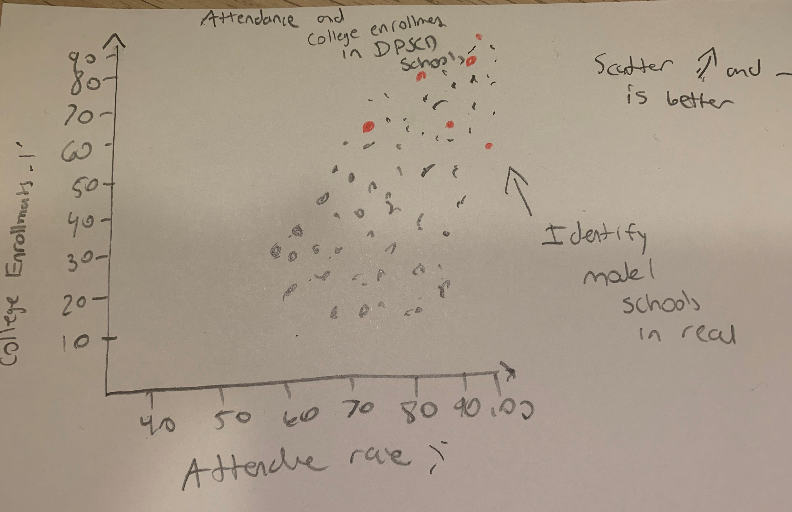
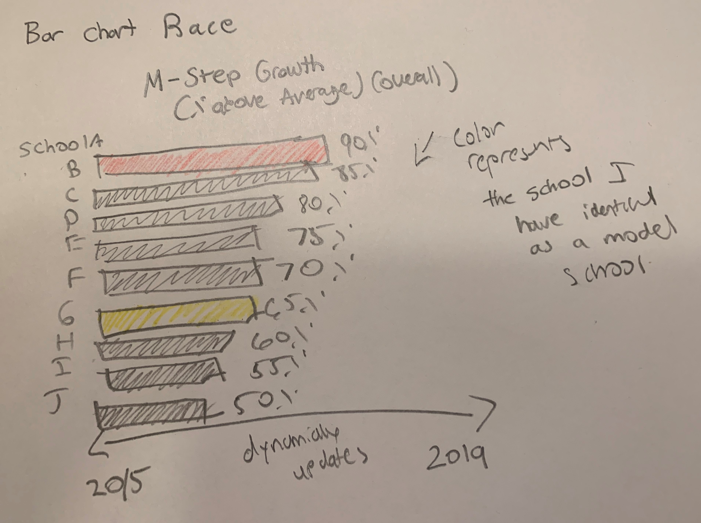
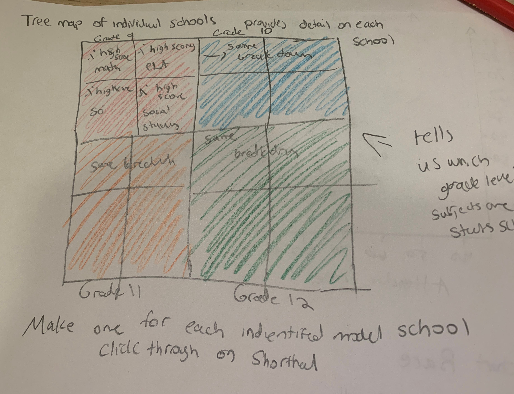

[Return to home](https://danieldistler-1.github.io/Distler-portfolio/)

# Final Project Proposal

## Summary 
For my final project, I want to use data analysis and visualization to understand the performance of schools in Detroit Public Schools Community District (DPSCD). I will focus on using publicly available District and State data to identify common attributes of successful schools in the district and help identify high-performing model schools in the district. 

## Context: Why DPSCD?
DPSCD is the largest district in the state of Michigan with over [50,000 students](https://www.mischooldata.org/student-enrollment-counts-report/). The District peaked in the 1960's with over [300,000 students](https://landgrid.com/reports/schools#credits) but has consistently seen descreasing funding, achievement and enrollment. This cultimated in 2009, when after the financial criss, the district was placed under state-appointed emergency management. While the district has been the subject of a myriad of reporting and visualization, much of this work has focused on the district's [spectacular fall](https://landgrid.com/reports/schools#credits) and detailed the depths of the districts failure. However, the district, along with the city of Detroit more generally, has made significant economic, and academic progress in teh past few years. I want to use this project to help tell this part of the story. I will use [publicly available data](https://www.detroitk12.org/Page/9634) to tell the story of DPSCD schools that are suceeding and have been part of the positive change in the city. 

This story is particularly important, for me, because after graduating college, I spent two years teaching 6th Grade English at a DPSCD school.  While there, I saw the positive work that has taken place in the District under new superintendent [Dr. Vitti](https://www.detroitk12.org/superintendent). Dr. Vitti recently annoucned a [new strategic plan](https://www.detroitk12.org/cms/lib/MI50000060/Centricity/Domain/4036/Blueprint_2020_Strategies_Only.pdf) for the district's future. A major component of the plan involves identifying the model schools that the District can replicate across the city. This project will attempt to use the publicly available data to identify these such schools and the attributes they have in common. 

## Project Structure and Sketches
The following provides an overview of the various sections and visualizations that I anticipate including in my final project, to tell the story defined above. These sections and visualizations, are crudely hand drawn (to the best of my ability), and reflect my expectations of what the data will look like, rather than the data itself. 

### Identifying High-Performing Schools 

The first section will focus on identifying these model schools. I will use data on a number of positive indicators to identify which schools are the highest performing. Some visualizations, I plan to include to help identify these schools are: 

#### Scatterplot  
The scatter plot sketched below will show the most recent data for DPSCD schools, with attendance rate on the X axis and college enrollment percentage on the Y axis. Up and to the right will signify better. The model schools, ones that are the best on these categories will stand out in red, the rest of schools will be shown in gray. 

#### Bar Chart Race
The bar chart race will show the Top N schools on a certain metric. The one imagined here is M-Step (Michigan's Standardized Test) % of students with above average growth in 2015-2019. High Performing Model Schools will be indicated with colors this can dynamically update over time, through Flourish's bar chart race graphic. 

### Attributes of High Achieving Schools 
After establishing which schools meet the criteria of model schools, through their performance on certain metrics, the next step will be to look deeper at demographics within each school. 

#### Treemap 
This crudely, drawn tree map would be filled with the data actually given in the project. It would look at each grade level for the school and within each grade level broken down by subject. The size would be determined by the % of students with Above Average scoring on standardized tests for each subject. 

#### Sample Survey of Model Schools 
Lastly I would use the Flourish Sample Survey visualization to get even more detail about each high achieving school. The school could be broken down and grouped by categorical variables and sized by continous variables possibilities are listed in the sketch. Each dot represents one high achieving school. 

#### Conclusions
I would finally summarize the takeaways from both which schools were high-achieving and the common demographic attributes of these schools. This could serve to further DPSCD's ability to identify and cultivate top performing schools. 

## The Data 
The data used from this project is aggregated from the [DPSCD open data files website](https://www.detroitk12.org/Page/9634). Using this hub, I downloaded and aggregated DPSCD data on [Student Attendance](https://danieldistler-1.github.io/Distler-portfolio/DPSCD%20Attendance%20Data%202015-2019.csv), [Assessment Growth Data](https://danieldistler-1.github.io/Distler-portfolio/DPSCD%20Growth%20Data.csv) and [College Enrollment](https://danieldistler-1.github.io/Distler-portfolio/DPSCD%20Attendance%20Data%202015-2019.csv). These hyperlinks go directly to the aggregated csv files that I will use for this assignment.   

## Method and Medium 
I plan to build a story using **Shorthand**. I think this medium will lend itself well to this project. Using this format, I plan to **mix written research with informative visualizations**. I know there will be a fair amount data cleaning and preprocessing that will be neeeded to get the data into the correct form for each visualization. In aggregating the .csv files linked above I have already begun this process. Before completing each visualization I know I will need to do some combination of grouping, filtering and sorting the data. I plan to do as much of this as possible in excel. Once this is done, I plan to generate these visualizations using both Tableau and Flourish. Flourish will be used to create the Bar Chart Race, and Sample Survey visualizations, because these were drawn with these flourish tools in mind, and I will consider using Tableau (or perhaps Flourish as well) to create the scatter plots and Treemaps sketched above. 

In addition, I will draw on my experience working in DPSCD and additional research to provide ample historical context. Shorthand's story format will allow me to mix this written information with my visualization. For my final presentation, I will present my shorthand story, in a similiar way to Riley's demonstration in class, and explain each visualization will pointing out the highlights of my written text. 
